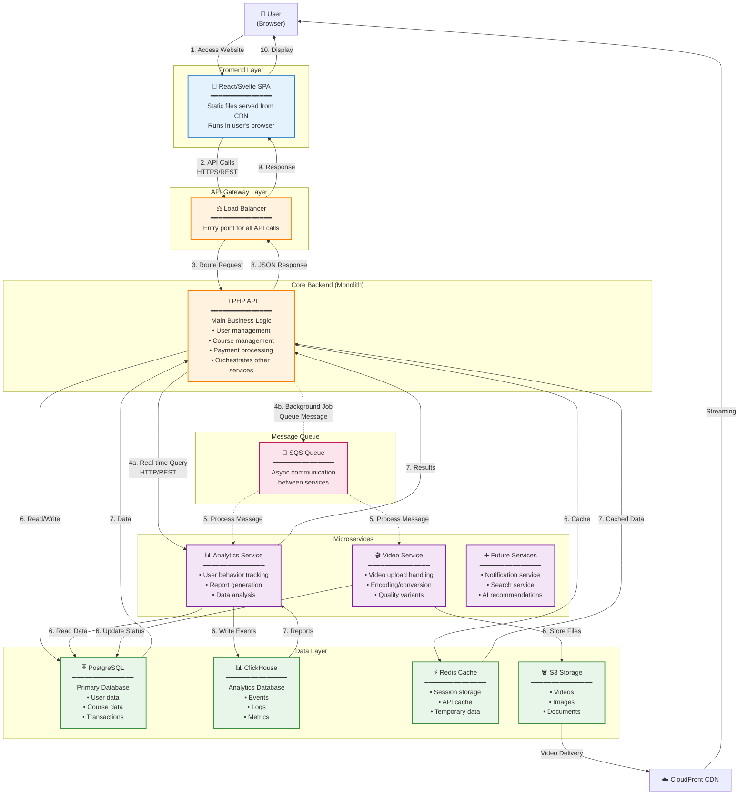

# Service-to-Service Communication - Overview

## 🎯 High-Level Communication Flow

Let me explain how services communicate in the KnowledgeCity platform in a simple way.

---

## 📊 Simple Communication Diagram



---

## 🔄 Communication Patterns

### Pattern 1: Synchronous Communication (Real-time)
**Used when:** Immediate response needed

```
User Request → SPA → Load Balancer → PHP API → Database → Response
                                        ↓
                                   Microservice
                                   (if needed)
```

**Example:** User logs in
1. User submits login form
2. SPA calls `/api/auth/login`
3. Load balancer routes to PHP API
4. PHP validates credentials in PostgreSQL
5. PHP returns JWT token
6. SPA stores token and redirects to dashboard

**Protocol:** HTTP/REST with JSON
**Time:** < 500ms expected

---

### Pattern 2: Asynchronous Communication (Background)
**Used when:** Task takes time, response not immediate

```
User Action → PHP API → Queue (SQS) → Microservice → Process → Update DB
                  ↓
              Return "Accepted"
```

**Example:** User uploads video
1. User uploads video file
2. PHP API saves to S3 and returns immediately
3. PHP sends message to SQS queue
4. Video Service picks up message from queue
5. Video Service processes video (10-30 min)
6. Video Service updates status in database
7. User gets notification when done

**Protocol:** Message Queue (SQS)
**Time:** Can take minutes/hours

---

## 📝 Common Scenarios Explained

### Scenario 1: User Browses Courses
```
┌─────────────────────────────────────────────────┐
│ 1. User clicks "Browse Courses"                 │
│    ↓                                            │
│ 2. SPA calls: GET /api/courses                  │
│    ↓                                            │
│ 3. Load Balancer → PHP API                      │
│    ↓                                            │
│ 4. PHP checks Redis cache first                 │
│    ├─ Cache HIT: Return immediately             │
│    └─ Cache MISS:                               │
│         ├─ Query PostgreSQL for courses         │
│         ├─ Store in Redis for next time         │
│         └─ Return courses                       │
│    ↓                                            │
│ 5. PHP returns JSON to SPA                      │
│    ↓                                            │
│ 6. SPA displays courses to user                 │
└─────────────────────────────────────────────────┘

Communication:
✅ Synchronous (user waits)
✅ Cached (fast response)
✅ Single service (PHP API)
```

---

### Scenario 2: User Watches Video
```
┌─────────────────────────────────────────────────┐
│ 1. User clicks "Watch Video"                    │
│    ↓                                            │
│ 2. SPA calls: GET /api/courses/123/video        │
│    ↓                                            │
│ 3. PHP API returns video URL (S3 CloudFront)    │
│    ↓                                            │
│ 4. SPA loads video from CDN (not through API!)  │
│    ↓                                            │
│ 5. MEANWHILE: SPA sends analytics event         │
│    POST /api/analytics/video-view               │
│    ↓                                            │
│ 6. PHP API sends to SQS queue (async)           │
│    ↓                                            │
│ 7. Analytics Service processes later            │
│    └─ Stores in ClickHouse                      │
└─────────────────────────────────────────────────┘

Communication:
✅ Video: Direct from CDN (fast)
✅ Analytics: Asynchronous (doesn't slow down user)
✅ Two services: PHP API + Analytics Service
```

---

### Scenario 3: User Uploads Video (Complex)
```
┌─────────────────────────────────────────────────┐
│ 1. User uploads video file                      │
│    ↓                                            │
│ 2. SPA calls: POST /api/videos/upload           │
│    ↓                                            │
│ 3. PHP API:                                     │
│    ├─ Generates pre-signed S3 URL               │
│    └─ Returns URL to SPA                        │
│    ↓                                            │
│ 4. SPA uploads directly to S3                   │
│    (doesn't go through API!)                    │
│    ↓                                            │
│ 5. S3 triggers event → SQS Queue                │
│    ↓                                            │
│ 6. Video Service picks up message:              │
│    ├─ Downloads raw video from S3               │
│    ├─ Converts to multiple formats:             │
│    │   • 1080p, 720p, 480p, 360p               │
│    │   • Generates thumbnails                   │
│    ├─ Uploads processed videos to S3            │
│    └─ Updates status in PostgreSQL              │
│    ↓                                            │
│ 7. PHP API notifies user (via notification)     │
└─────────────────────────────────────────────────┘

Communication:
✅ Upload: Direct to S3 (fast, doesn't block API)
✅ Processing: Asynchronous via queue
✅ Multiple services: PHP API + Video Service
✅ Takes 10-30 minutes in background
```

---

### Scenario 4: Admin Views Analytics Dashboard
```
┌─────────────────────────────────────────────────┐
│ 1. Admin opens analytics dashboard              │
│    ↓                                            │
│ 2. SPA calls: GET /api/analytics/dashboard      │
│    ↓                                            │
│ 3. PHP API forwards to Analytics Service        │
│    POST → http://analytics-service/query        │
│    ↓                                            │
│ 4. Analytics Service:                           │
│    ├─ Queries ClickHouse (millions of events)  │
│    ├─ Aggregates data                           │
│    └─ Returns summary                           │
│    ↓                                            │
│ 5. PHP API returns to SPA                       │
│    ↓                                            │
│ 6. SPA displays charts and graphs               │
└─────────────────────────────────────────────────┘

Communication:
✅ Synchronous (admin waits for report)
✅ Service-to-service: PHP → Analytics
✅ May take 5-10 seconds for complex reports
```

---

## 🔗 Service-to-Service Communication Methods

### Method 1: HTTP/REST (Synchronous)
**When to use:** Need immediate response

```
PHP API ──HTTP POST──> Analytics Service
         (request)
         
PHP API <──JSON──────── Analytics Service
         (response)
```

**Pros:**
✅ Simple to implement
✅ Immediate response
✅ Easy to debug

**Cons:**
❌ Caller must wait
❌ If service is down, request fails
❌ Can create tight coupling

---

### Method 2: Message Queue (Asynchronous)
**When to use:** Background processing, can wait

```
PHP API ──message──> SQS Queue ──message──> Video Service
         (send)                   (receive)
         
PHP API returns immediately
(doesn't wait for processing)
```

**Pros:**
✅ Doesn't block caller
✅ Services can be offline temporarily
✅ Automatic retry on failure
✅ Scales independently

**Cons:**
❌ More complex
❌ No immediate response
❌ Need monitoring

---

### Method 3: Event-Driven (Pub/Sub)
**When to use:** Multiple services need to know about event

```
User uploads video
         ↓
     S3 Event
         ↓
    SNS Topic
    ↙    ↓    ↘
Video   Analytics  Notification
Service  Service    Service
```

**Pros:**
✅ Loose coupling
✅ Easy to add new services
✅ Services don't need to know about each other

**Cons:**
❌ More complex
❌ Harder to trace flow
❌ Need good monitoring

---

## 🌐 Multi-Region Communication

### Regional Isolation (Data Sovereignty)
```
US User                          Saudi User
   ↓                                ↓
US Region                      Saudi Region
   ↓                                ↓
US PHP API                    Saudi PHP API
   ↓                                ↓
US Database                   Saudi Database

❌ NO COMMUNICATION BETWEEN REGIONS FOR USER DATA
```

### Global Content (Courses)
```
Course Created in US Region
         ↓
    Stored in S3
         ↓
Cross-Region Replication
         ↓
    Saudi S3 Copy
         ↓
Both regions serve from local copy
```

---

## 📋 Communication Summary by Use Case

| Use Case | Pattern | Communication | Time |
|----------|---------|---------------|------|
| **User Login** | Sync | SPA → PHP → DB | < 500ms |
| **Browse Courses** | Sync | SPA → PHP → Redis/DB | < 200ms |
| **Upload Video** | Async | SPA → S3 → Queue → Video Service | 10-30 min |
| **Watch Video** | Direct | SPA → CDN (bypass API) | Instant |
| **Track Analytics** | Async | SPA → PHP → Queue → Analytics | Background |
| **View Reports** | Sync | SPA → PHP → Analytics → ClickHouse | 5-10 sec |
| **Send Notification** | Async | PHP → Queue → Notification Service | < 1 min |

---

## 🎯 Key Principles

### 1. **API Gateway Pattern**
- All client requests go through Load Balancer first
- Load Balancer routes to appropriate service
- Single entry point for security and monitoring

### 2. **Orchestration via PHP Monolith**
- PHP API is the "conductor"
- It coordinates between microservices
- It handles business logic and workflows

### 3. **Async for Heavy Tasks**
- Video processing: Queue-based
- Analytics: Queue-based
- Notifications: Queue-based
- **Rule:** If it takes > 3 seconds, make it async

### 4. **Cache Everything Possible**
- Course list: Cached in Redis (5 min)
- User profile: Cached in Redis (10 min)
- Static assets: Cached in CDN (24 hours)

### 5. **Direct CDN for Media**
- Videos don't go through API
- Pre-signed URLs for uploads
- CloudFront for downloads
- Reduces API load by 80%

---

## 🔍 How to Trace a Request

Every request has a **Trace ID** that follows it through all services:

```
User Request
  ↓
trace-id: abc-123-def
  ↓
PHP API (logs: trace-id: abc-123-def)
  ↓
Analytics Service (logs: trace-id: abc-123-def)
  ↓
ClickHouse (logs: trace-id: abc-123-def)
```

This allows you to:
- ✅ Track request across all services
- ✅ Debug issues
- ✅ Measure performance
- ✅ Find bottlenecks

We use **OpenTelemetry** for this (see ARCHITECTURE_DESIGN.md Section 2.2)

---

## 💡 Simple Mental Model

Think of it like a restaurant:

```
🏢 Restaurant (KnowledgeCity Platform)

👤 Customer (User)
   ↓
🚪 Entrance (Load Balancer)
   ↓
👨‍💼 Waiter (PHP API)
   ↓
   ├─ 🍳 Kitchen (Video Service) - "I'll cook it and bring it later"
   ├─ 🥗 Salad Bar (Cache) - "Here's what's already prepared"
   ├─ 📋 Manager (Analytics) - "Let me check our records"
   └─ 🍷 Wine Cellar (Database) - "Let me get it from storage"
```

**Key Points:**
- Waiter (PHP) takes your order
- Some things are ready immediately (cache)
- Some things take time to prepare (queue/async)
- Waiter coordinates everything
- You get your food (response)

---

## 🎓 Summary

### Communication Flow Overview:
1. **User → Frontend (SPA)** - Browser loads React app from CDN
2. **Frontend → Load Balancer** - All API calls go here first
3. **Load Balancer → PHP API** - Main entry point
4. **PHP API → Services** - Coordinates via HTTP or Queue
5. **Services → Data Layer** - Read/write data
6. **Response flows back** - Through same path

### Two Main Patterns:
- **🔄 Synchronous (HTTP/REST)** - When you need immediate answer
- **⏱️ Asynchronous (Queue)** - When task takes time

### Key Design Decisions:
- ✅ PHP as orchestrator (conductor)
- ✅ Microservices for specific heavy tasks
- ✅ Queue for anything > 3 seconds
- ✅ Cache aggressively
- ✅ CDN for media (bypass API)

---

**Still confused?** Think of specific scenarios:
- Login? → Synchronous HTTP
- Upload video? → Async via queue
- Watch video? → Direct from CDN
- View analytics? → Sync HTTP to microservice

Each scenario has a clear pattern!

